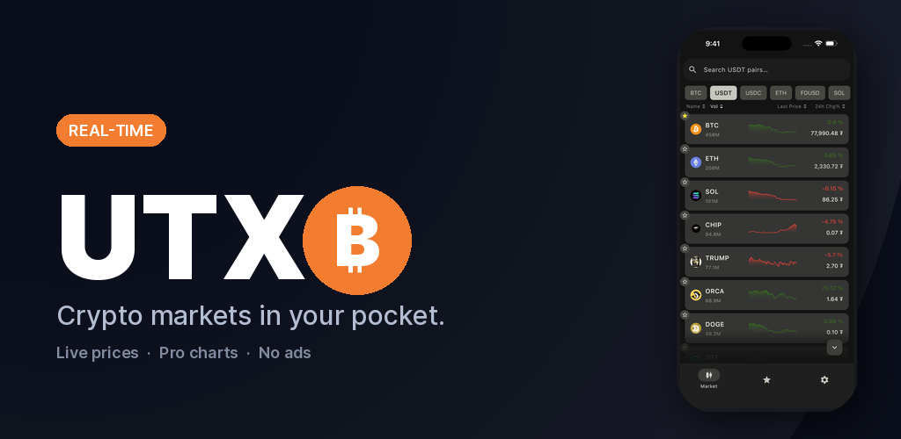
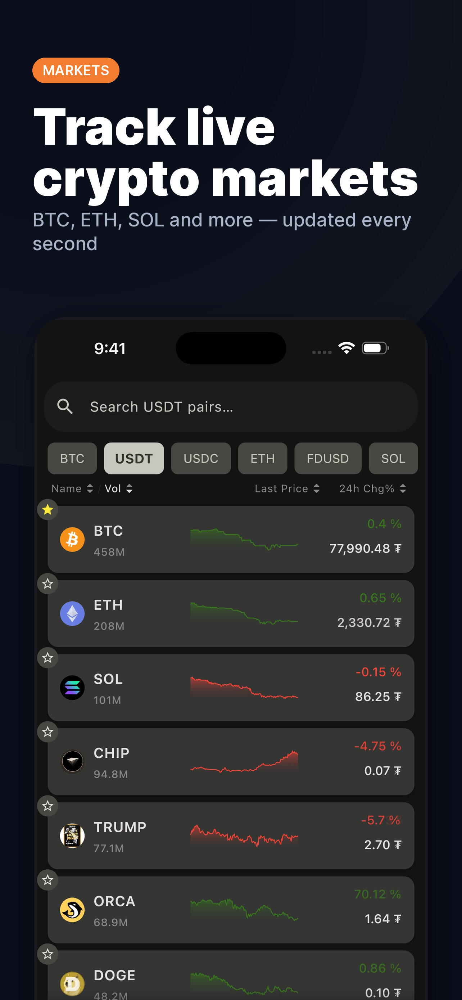
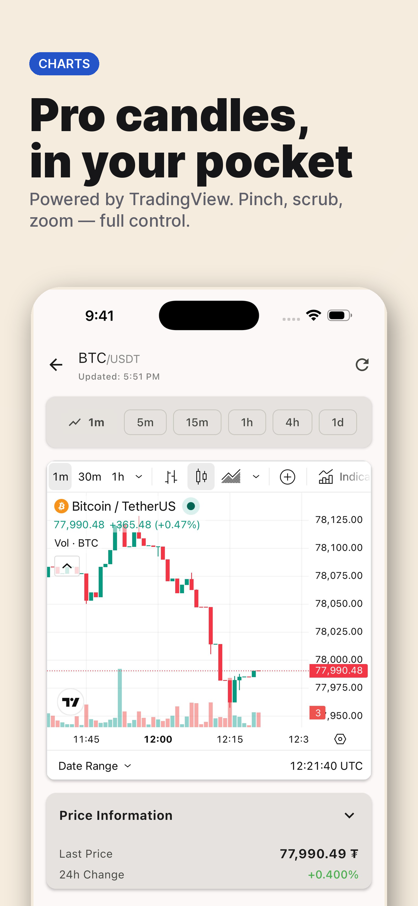
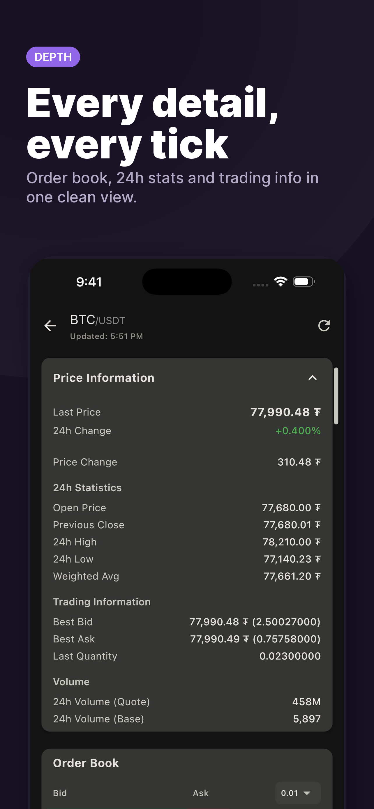
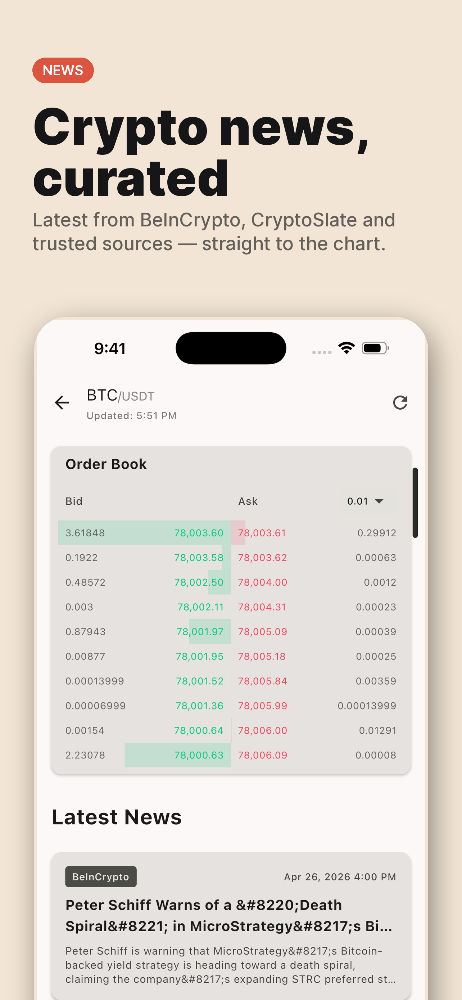
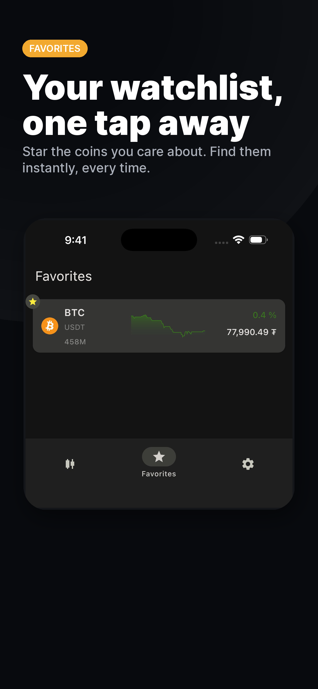
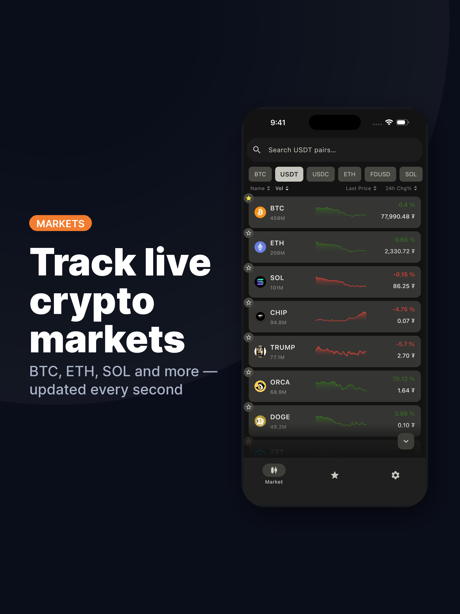
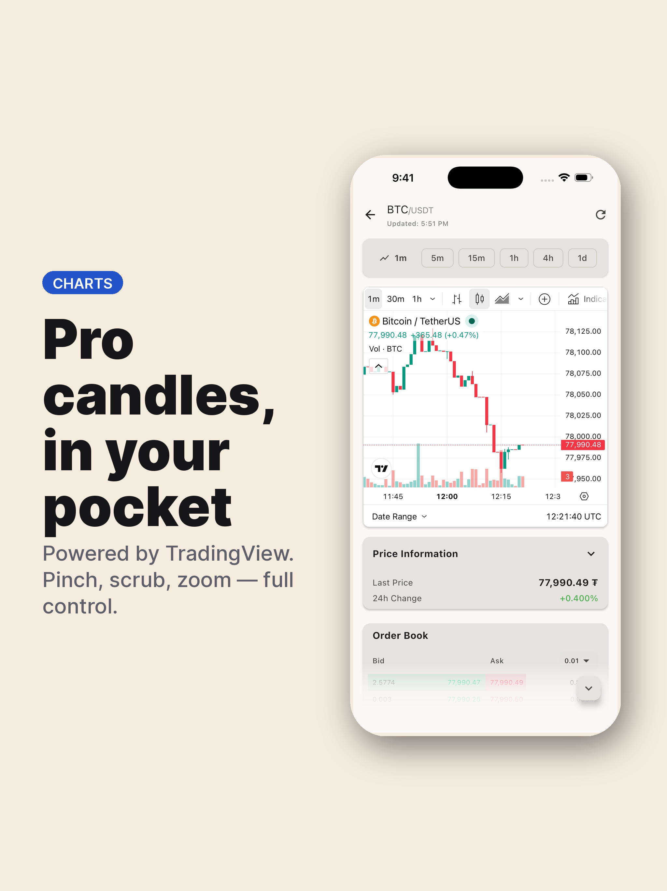
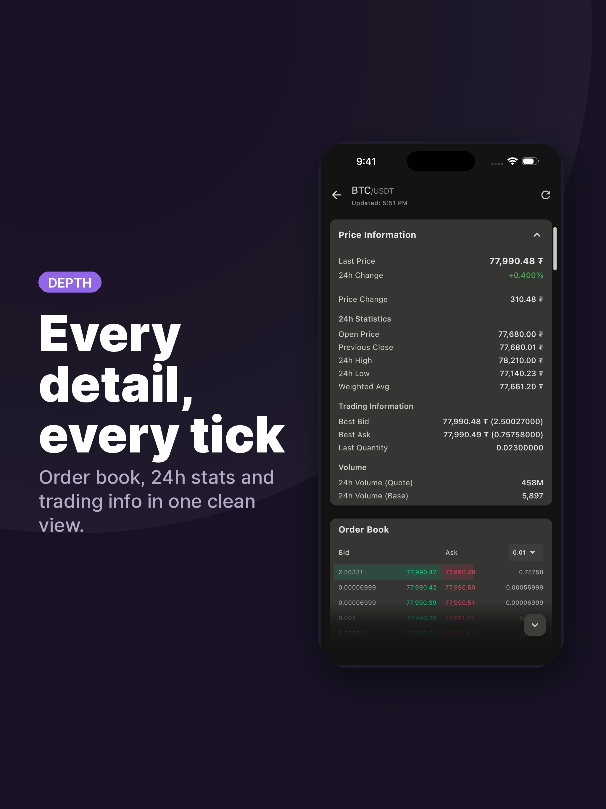
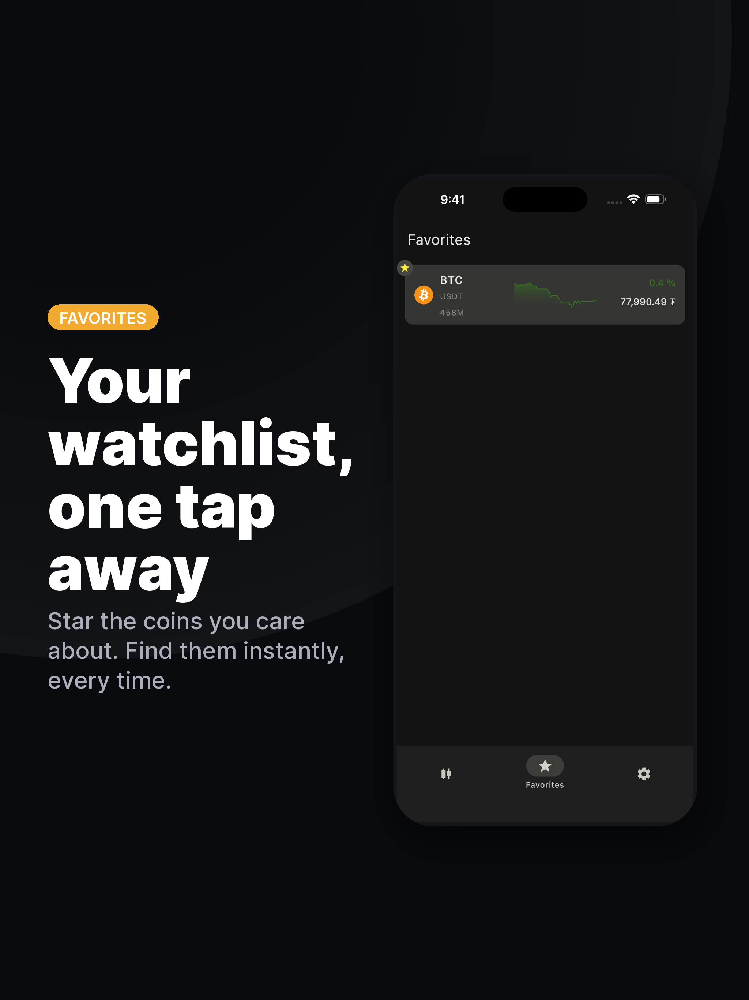

 [](https://github.com/percy-g2/kmp_utxo/actions/workflows/release.yml)

[](https://play.google.com/store/apps/details?id=org.androdevlinux.utxo)

[](https://apps.apple.com/in/app/utxo/id6746167853)

# UTXO - Cryptocurrency Tracker

A modern, cross-platform cryptocurrency tracking application built with Kotlin Multiplatform and Compose Multiplatform.

<p align="center">
  
</p>

<p align="center"><sub><b>iPhone</b> · 1284 × 2778 · App Store + Play Store</sub></p>

<table>
  <tr>
    <td></td>
    <td></td>
    <td></td>
    <td></td>
    <td></td>
  </tr>
</table>

<p align="center"><sub><b>iPad</b> · 2048 × 2732 · App Store iPad slot</sub></p>

<table>
  <tr>
    <td></td>
    <td></td>
    <td></td>
    <td></td>
    <td></td>
  </tr>
</table>

**UTXO** is a **Kotlin Multiplatform** cryptocurrency tracking application built with **Compose Multiplatform** that targets **Android**, **iOS**, **JVM (Desktop)**, and **Web** platforms. The app provides real-time cryptocurrency price data using the [Binance WebSocket API](https://developers.binance.com/docs/binance-spot-api-docs/web-socket-streams) and comprehensive market information.

## Tech Stack
- **Kotlin Multiplatform** - Shared business logic across all platforms
- **Compose Multiplatform** - Modern declarative UI framework
- **Coroutines & Flow** - Asynchronous operations and reactive data streams
- **Ktor** - HTTP client and WebSocket support for network operations
- **KStore** - Persistent storage management for user preferences
- **Kotlinx Serialization** - JSON parsing and data serialization
- **Kotlinx DateTime** - Date and time handling

## Features

### 📊 Market Screen
- **Real-time price updates** via Binance WebSocket connection
- **Live cryptocurrency list** with price changes, 24h volume, and market statistics
- **Search functionality** to quickly find cryptocurrencies
- **Sorting options** by volume, price change, and more
- **Smooth animations** and transitions

### ⭐ Favorites
- **Save favorite cryptocurrencies** for quick access
- **Persistent favorites** stored locally across app sessions
- **Quick navigation** to favorite coin details

### 📱 Widgets
- **Home screen widget** displaying up to 4 favorite cryptocurrency pairs
- **Real-time price data** with automatic updates every 5 minutes
- **Interactive sparkline charts** showing 1000 data points (1-second intervals)
- **Price information** including:
  - Current price with proper formatting
  - 24-hour price change percentage (color-coded)
  - Trading volume (formatted for readability)
- **Theme-aware design** that matches your app theme (light/dark mode)
- **Quick navigation** - Tap any favorite to open its coin detail screen
- **Manual refresh** button for instant updates
- **Platform-specific features:**
  - **Android**: Rounded corners and modern Material Design styling
  - **iOS**: Native WidgetKit integration with medium and large widget sizes (2 and 4 favorites respectively)

### 📈 Coin Detail Screen
- **Interactive candlestick charts** with price history visualization
- **24-hour ticker statistics** including:
  - High/Low prices
  - Price change percentage
  - Trading volume (base and quote)
  - Best bid/ask prices
  - Weighted average price
- **Latest news feed** aggregated from multiple RSS sources:
  - CoinDesk
  - CoinTelegraph
  - Decrypt
  - The Block
  - CryptoSlate
  - U.Today
  - Bitcoin Magazine
  - BeInCrypto
- **News filtering** by coin symbol with intelligent matching
- **Real-time price updates** displayed in the header

### ⚙️ Settings
- **Theme customization**:
  - System default (follows device theme)
  - Light mode
  - Dark mode
- **News source selection** - Enable/disable RSS providers
- **About section** with:
  - App version information
  - Privacy Policy link
  - Website link
  - GitHub repository link

### 🌐 Cross-Platform Support
- **Android** - Native Android app with Material Design 3
- **iOS** - Native iOS app with SwiftUI integration
- **JVM (Desktop)** - Native desktop applications for Windows, macOS, and Linux
- **Web** - Web with wasmJS

### 🔔 Additional Features
- **Network connectivity monitoring** - Alerts when offline
- **Optimized performance** - WebSocket pause/resume for memory efficiency
- **Error handling** - Graceful error states and retry mechanisms
- **Responsive design** - Adapts to different screen sizes

## Development Workflow

This project uses AI agent skills (Cursor and Claude Code) to automate common git workflows. Say the trigger phrase and the agent handles the rest.

| Skill | Trigger phrases |
|---|---|
| **push-code** | "push my code", "commit and push" |
| **create-pr** | "create a PR", "open pull request" |
| **review-pr** | "review PR #42", "check this PR" |
| **merge-pr** | "merge PR #42", "land this branch" |
| **pcr** | "pcr" — full pipeline: push + create PR + review |
| **deploy-ss** | "make store screenshots", "feature graphic", "prepare App Store / Play Store assets" |

> The screenshots above were produced by the **deploy-ss** skill from raw app captures in `raw-screenshots/`. Re-run it whenever the UI changes — see [`.claude/skills/deploy-ss/SKILL.md`](.claude/skills/deploy-ss/SKILL.md) for the workflow and [`references/specs.md`](.claude/skills/deploy-ss/references/specs.md) for App Store / Play Store dimension requirements.

See the [Cursor Agents Guide](docs/CURSOR_AGENTS_GUIDE.md) for examples and the full reference in [`AGENTS.md`](AGENTS.md).

## Building the Project

### Prerequisites
- JDK 17 or higher
- Android Studio or IntelliJ IDEA
- Xcode (for iOS builds)
- Gradle 8.0+

### Build Commands
```bash
# Build for all platforms
./gradlew build

# Build for specific platform
./gradlew :composeApp:assembleDebug          # Android
./gradlew :composeApp:iosSimulatorArm64Binaries # iOS Simulator
./gradlew :composeApp:runDistributable      # JVM Desktop
./gradlew :composeApp:wasmJsBrowserDevelopmentRun # Web

# Run tests
./gradlew test
```

## Platform-Specific Notes

### Android
- Minimum SDK: 24
- Target SDK: 34
- Uses Material Design 3 components
- **Home Screen Widget** - Add the favorites widget to your home screen:
  1. Long-press on home screen
  2. Select "Widgets" from the menu
  3. Find "UTXO Favorites" widget
  4. Drag to desired location
  5. Widget automatically displays your favorite cryptocurrencies
- Widget features:
  - Automatic refresh every 5 minutes
  - Manual refresh button
  - Tap any coin to view details
  - Theme-aware (matches app theme)
  - Displays up to 4 favorites with charts

### iOS
- Minimum iOS version: 15.0
- Requires Xcode 14.0+
- Uses SwiftUI for app lifecycle
- **Home Screen Widget** - Add the favorites widget to your home screen:
  1. Long-press on home screen
  2. Tap the "+" button in the top-left corner
  3. Search for "UTXO" or scroll to find "UTXO Favorites"
  4. Select widget size (Medium or Large)
  5. Tap "Add Widget" and position on home screen
  6. Widget automatically displays your favorite cryptocurrencies
- Widget features:
  - Automatic refresh every 5 minutes (managed by iOS WidgetKit)
  - Manual refresh button (↻ icon in header)
  - Tap any coin to view details (deep linking)
  - Theme-aware (respects system light/dark mode)
  - Medium widget: Displays 2 favorites with charts
  - Large widget: Displays 4 favorites with charts
  - Empty state message when no favorites are added

### Web
- Built with Kotlin/Wasm
- Uses WebSocket API for real-time updates
- CORS proxy support for RSS feeds

### JVM (Desktop)
- Built on JVM for Windows, macOS, and Linux
- Native window management with Compose Desktop
- Requires JDK 17+ for building and running

## License

This project is licensed under the GNU General Public License v3.0 (GPLv3) - see the [LICENSE](LICENSE) file for details.

The GPLv3 is a strong copyleft license that requires anyone who distributes your code or a derivative work to make the source available under the same terms. This license is particularly suitable for software that you want to keep open and free.

Key points of the GPLv3:
- You can use the software for any purpose
- You can change the software and distribute modified versions
- You can share the software with others
- If you distribute modified versions, you must share your modifications under the GPLv3
- You must include the license and copyright notice with each copy of the software
- You must disclose your source code when you distribute the software

For the full license text, visit: https://www.gnu.org/licenses/gpl-3.0.en.html
